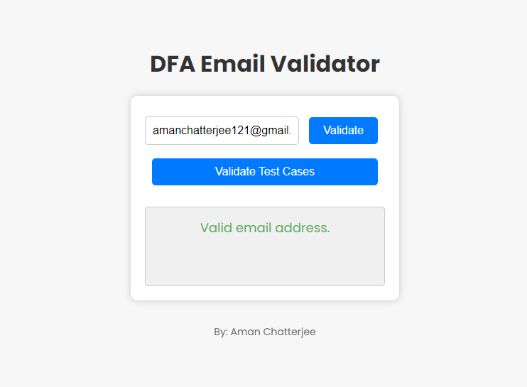
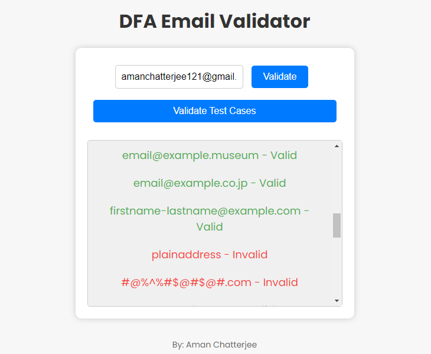
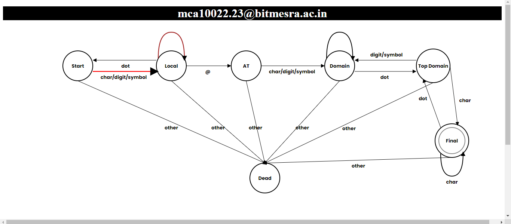

# DFAEmailValidator
 Its, a simple email validator/checker which uses Deterministic Finite Automata (DFA) to find pattern of an email.
 Also, shows the State transitions diagram of the email with animation.

<!DOCTYPE html>
<html lang="en">
<body>
  

    
    
   
  

</html>
